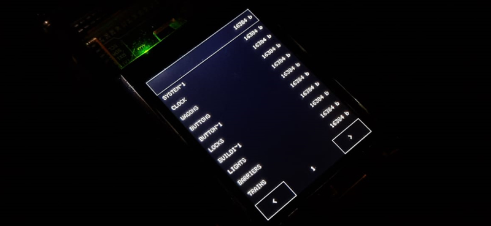

# SD Card Explorer

 

## Parts:
* Arduino MEGA 2560
* A [2.8'' TFT LCD shield w/Cap Touch and microSD](https://www.adafruit.com/product/1947)
* A microSD

## Setup:
1. Make sure your microSD has files and folders to explore
1. Attach the TFT to the top of the arduino
1. Change your settings in reader.ino
    * `DEBUG`: whether or not to serial print debug messages
    * `BRIGHTNESS`: 0-255 for the backlight strength
1. Upload the sketch
1. Explore :)
